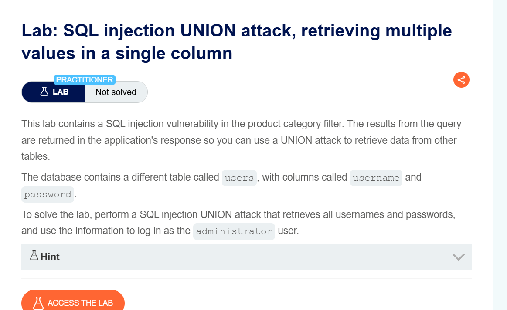
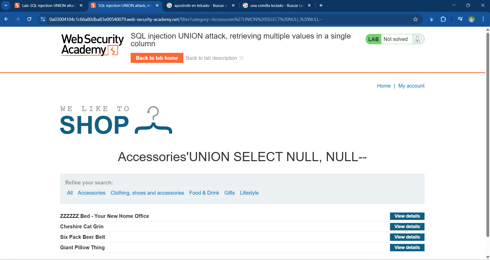

# Laboratorio 10: SQL Injection UNION Attack, Retrieving Multiple Values in a Single Column 
## Objetivo  
Mostrar usuario y contraseña en una tabla e iniciar sesión como **ADMINISTRATOR**  


---

## Análisis de la Base de Datos  

En primer lugar identificamos o nos guiamos de una sentencia base la cual después de la estructura de category en nuestro caso "Accesorios", realizamos una busqueda de tipo 'UNION SELECT: con el fin de encontrar en que columna se encuentra alojado las tablas.

'UNION SELECT NULL-- primera columna (-- para terminar la sentencia)

'UNION SELECT NULL, NULL-- segunda columna, obtenemos un resultado con el cual conluimos que en la posición 2 se encuentran alojadas las tablas como se observa en la imgane.


El segundo campo de la base de datos es el campo de la columna que almacena los títulos.  

Se realiza la siguiente búsqueda partiendo de lo descubierto: el **campo dos** es donde se debe inyectar información. En este caso, para localizar el **nombre de la tabla** que se desea atacar.  

Se encuentra la tabla `users`, y se verifica que es la misma que proporciona el laboratorio.  

## Obtención de Datos  

A continuación, se ejecuta una búsqueda para listar todos los campos dentro de la tabla `users`.  

Consulta modificada siguiendo la **SQL Injection Cheat Sheet**, considerando que se trabaja en **PostgreSQL**:  

```sql
SUBSTRING('foobar', 4, 2)
